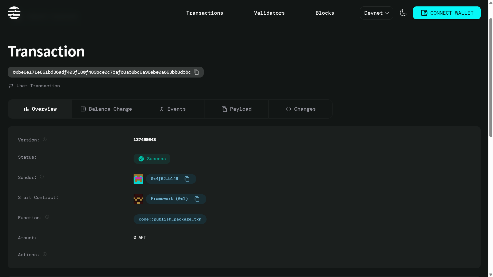

# Multi-Signature Wallet for DeFi Platforms

## Decentralized Multi-Signature Wallet on Aptos

## Description
The **Decentralized Multi-Signature Wallet** is a secure and transparent smart contract built on the **Aptos blockchain**. Designed for **Decentralized Finance (DeFi)** applications, this wallet enhances asset security by requiring multiple approvals before executing transactions. This mechanism ensures collective decision-making, reducing unauthorized access risks while maintaining decentralized control.

## Vision
The vision of this project is to revolutionize digital asset management by providing a **decentralized, trustless, and transparent** multi-signature wallet solution. By leveraging Aptos' robust blockchain infrastructure, we aim to create a wallet that ensures **security, governance, and interoperability** within the DeFi ecosystem. This project aspires to be the go-to solution for organizations, DAOs, and individuals seeking secure multi-party asset management.

## Future Scope
1. **Advanced Governance Mechanisms**: Implement features that allow wallet owners to propose changes and vote on modifications to wallet parameters.
2. **Seamless DeFi Integration**: Ensure compatibility with DeFi platforms to enable staking, lending, and other financial operations directly from the wallet.
3. **Enhanced User Interface (UI)**: Develop an intuitive and user-friendly front-end interface for better accessibility and user experience.
4. **Automated Transaction Execution**: Introduce smart automation for specific transactions based on predefined conditions.
5. **Cross-Chain Support**: Expand the wallet's functionality to support multiple blockchain networks for seamless interoperability.

## Smart Contract Details

### Module
- **Module Name**: `MultiSigDeFi::Wallet`

### Structs
- **MultiSigWallet**:
  - `owners`: A list of wallet owner addresses.
  - `required`: The number of approvals needed for transactions.
  - `balance`: The current wallet balance.

### Functions
1. **create_wallet**
   - **Description**: Creates a multi-signature wallet with specified owners and required signatures.
   - **Parameters**:
     - `creator`: The signer creating the wallet.
     - `owners`: A vector of owner addresses.
     - `required_signatures`: The number of approvals required.
   
   ```move
   public entry fun create_wallet(
       creator: &signer,
       owners: vector<address>,
       required_signatures: u64
   ) {
       // Function logic...
   }
   ```

2. **deposit_funds**
   - **Description**: Allows users to deposit funds into the multi-signature wallet.
   - **Parameters**:
     - `sender`: The signer depositing funds.
     - `wallet_addr`: The multi-signature wallet address.
     - `amount`: The amount to deposit.
   
   ```move
   public entry fun deposit_funds(
       sender: &signer,
       wallet_addr: address,
       amount: u64
   ) acquires MultiSigWallet {
       // Function logic...
   }
   ```

## Deployment Instructions
### Prerequisites
- Install the **Aptos CLI**.
- Set up an Aptos account.

### Steps
1. **Compile the contract**:
   ```sh
   aptos move compile --package-path .
   ```
2. **Deploy to Aptos Testnet**:
   ```sh
   aptos move publish --package-path . --profile testnet
   ```
3. **Get the contract address** and update it in `Move.toml`.
---
### Contract Address
`0x4f62e786328f4d75ac9eb18b880d59ae2a94b182e29b935a1ac29178f047b148`

### Transaction Hash
`0xbe6e171e861bd36adf403f180f489bce0c75af08a58bc6a96ebe0a663bb8d5bc`



---